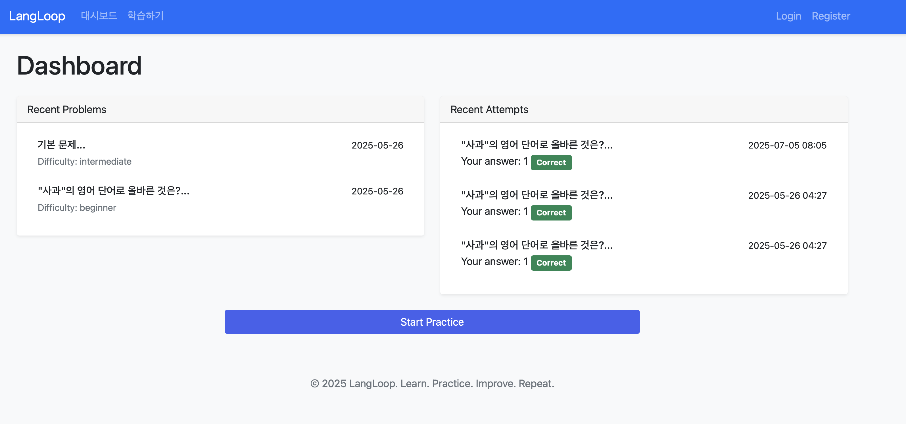
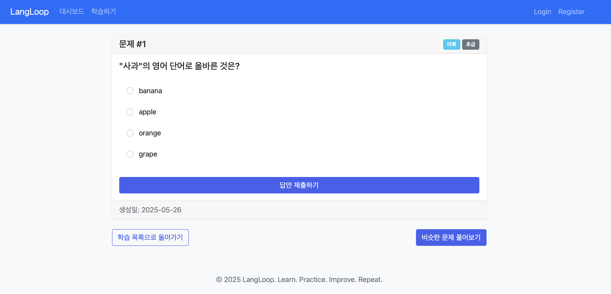

# LangLoop - AI 기반 영어 학습 플랫폼 🎯

> "Learn. Practice. Improve. Repeat."

LangLoop은 AI 기반의 반복형 영어 문제 생성 및 해설 시스템입니다. 사용자의 수준과 필요에 맞춘 맞춤형 문제를 제공하여 효과적인 영어 학습을 지원합니다.

## 📚 주요 기능

### 1. 맞춤형 문제 생성
- 문법, 어휘, 독해, 듣기 등 다양한 유형의 문제 제공
- 초급, 중급, 고급 난이도 선택 가능
- AI 기반 문제 생성으로 매번 새로운 학습 경험

### 2. 상세한 해설 제공
- 문제별 상세 해설
- 오답 분석
- 관련 문법 포인트 및 예문 제공

### 3. 학습 진행 상황 추적
- 최근 풀이한 문제 기록
- 정답률 통계
- 취약 분야 분석

## 🚀 시작하기

### 시스템 요구사항
- Python 3.8 이상
- pip (Python 패키지 관리자)

### 설치 방법

1. 저장소 클론
```bash
git clone https://github.com/lhg96/aiTopic.git
cd aiTopic
```

2. 가상환경 생성 및 활성화
```bash
python -m venv venv
source venv/bin/activate  # Windows: venv\Scripts\activate
```

3. 필요한 패키지 설치
```bash
pip install -r requirements.txt
```

4. 데이터베이스 초기화
```bash
flask db upgrade
```

5. 서버 실행
```bash
flask run
```

이제 웹 브라우저에서 http://localhost:5000 으로 접속하여 서비스를 이용할 수 있습니다.

## 📦 기술 스택

- **Backend**: Flask (Python)
- **Database**: SQLite
- **ORM**: SQLAlchemy
- **Frontend**: HTML5, CSS3, Bootstrap 5
- **Authentication**: Flask-Login

## 🌟 주요 특징

- **무료 체험**: 로그인 없이도 기본 기능 사용 가능
- **반응형 디자인**: 모바일, 태블릿, 데스크톱 등 모든 기기에서 최적화된 경험
- **직관적인 UI**: 사용하기 쉬운 인터페이스
- **실시간 피드백**: 문제 풀이 즉시 결과 확인 가능

## 📱 서비스 화면

### 🏠 메인 대시보드
- 최근 학습 현황 확인
- 추천 문제 제공
- 학습 통계 확인



### 📚 학습하기
- 카테고리별 문제 선택
- 난이도별 문제 생성
- 상세한 해설 제공



### 🧩 주요 기능 미리보기
- 직관적인 사용자 인터페이스
- 반응형 디자인으로 모든 기기에서 최적화
- 한글 지원으로 편리한 사용

## 📊 프로젝트 현황

### ✅ 완료된 기능
1. 기본 인프라 구축
   - Flask 애플리케이션 설정
   - 데이터베이스 모델 설계 (User, Problem, Attempt)
   - 기본 인증 시스템 구현

2. 프론트엔드 구현
   - 반응형 레이아웃 구현
   - Bootstrap 5 기반 UI 설계
   - 기본 템플릿 구성

3. 핵심 기능 구현
   - 문제 생성 기본 로직
   - 문제 풀이 시스템
   - 결과 피드백 시스템

### 🏗️ 진행 중인 작업
1. AI 문제 생성 시스템
   - [ ] GPT API 연동
   - [ ] 문제 템플릿 다양화
   - [ ] 난이도 조절 알고리즘

2. 학습 분석 시스템
   - [ ] 사용자 학습 패턴 분석
   - [ ] 맞춤형 문제 추천
   - [ ] 진도 관리 시스템

### 📝 향후 개발 계획

#### Phase 1: 기능 고도화 (2025 Q3)
- [ ] 사용자 프로필 시스템 개선
  - 학습 목표 설정
  - 학습 일정 관리
  - 성취도 배지 시스템
- [ ] 문제 생성 AI 모델 통합
  - OpenAI GPT API 연동
  - 문제 품질 검증 시스템
  - 사용자 피드백 반영

#### Phase 2: 소셜 기능 추가 (2025 Q4)
- [ ] 학습 그룹 시스템
  - 그룹 학습 기능
  - 실시간 학습 경쟁
  - 그룹 채팅
- [ ] 커뮤니티 기능
  - 질문 게시판
  - 학습 팁 공유
  - 멘토링 시스템

#### Phase 3: 플랫폼 확장 (2026 Q1)
- [ ] 모바일 앱 개발
  - iOS/Android 네이티브 앱
  - 푸시 알림 시스템
  - 오프라인 학습 지원
- [ ] API 서비스 제공
  - REST API 개발
  - SDK 개발
  - API 문서화

### ⚠️ 알려진 이슈
1. 데이터베이스 최적화 필요
   - 대량의 문제 생성 시 성능 저하
   - 캐싱 시스템 필요

2. UI/UX 개선 필요
   - 모바일 화면에서 일부 레이아웃 깨짐
   - 다크 모드 지원 필요

3. 보안 강화 필요
   - API 엔드포인트 보안 강화
   - 사용자 데이터 암호화 강화

## 🤝 프로젝트 참여하기

### 개발 환경 설정
1. 개발 도구
   - VS Code 또는 PyCharm 권장
   - Python 3.8 이상
   - Git

2. 코드 컨벤션
   - PEP 8 준수
   - Black 포맷터 사용
   - Type hints 사용

3. 테스트
   - pytest 사용
   - 테스트 커버리지 80% 이상 유지

### 기여 가이드라인
- 이슈 생성 전 먼저 검색
- 풀 리퀘스트 전 테스트 실행
- 커밋 메시지는 명확하게 작성
- 문서화 필수

## 📄 라이센스

이 프로젝트는 MIT 라이센스를 따릅니다. 자세한 내용은 [LICENSE](LICENSE) 파일을 참조하세요.

## 👥 기여하기

프로젝트에 기여하고 싶으시다면 다음 절차를 따라주세요:

1. 이 저장소를 Fork 합니다.
2. 새로운 Branch를 생성합니다 (`git checkout -b feature/AmazingFeature`)
3. 변경사항을 Commit 합니다 (`git commit -m 'Add some AmazingFeature'`)
4. Branch에 Push 합니다 (`git push origin feature/AmazingFeature`)
5. Pull Request를 생성합니다.

## � 학습 자료 출처

### 기본 문제 소스
1. 공신력 있는 영어 시험 문제
   - TOEIC 기출 문제 패턴
   - TOEFL 문제 구조
   - 수능 영어 기출 문제
   - Cambridge English Exams

2. 실용 영어 자료
   - BBC Learning English
   - VOA Learning English
   - TED Talks 스크립트
   - The New York Times Learning Network

3. AI 문제 생성을 위한 프롬프트 템플릿
   - 문법 문제 생성 패턴
   - 어휘 문제 변형 규칙
   - 독해 지문 난이도 조절
   - 발음/듣기 문제 생성 기준

### 해설 및 설명 자료
1. 영문법 참고 자료
   - Cambridge Grammar
   - Oxford Practice Grammar
   - Betty Azar's Understanding and Using English Grammar

2. 어휘 학습 자료
   - Oxford Collocations Dictionary
   - Longman Dictionary of Contemporary English
   - Academic Word List

### AI 모델 활용 계획
1. OpenAI GPT 모델
   - 문제 생성 및 변형
   - 맥락에 맞는 예문 생성
   - 상세 해설 작성

2. Google BERT 모델
   - 텍스트 난이도 분석
   - 문장 구조 분석
   - 어휘 수준 평가


## 📞 문의하기
개발 관련 컨설팅 및 외주 받습니다.

프로젝트 관리자 연락처:
- name: 임현근 (Hyun-Keun Lim)
- Email: hyun.lim@okkorea.net
- homepage: https://www.okkorea.net